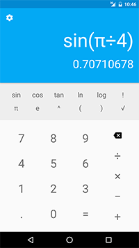
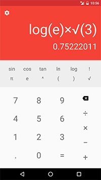
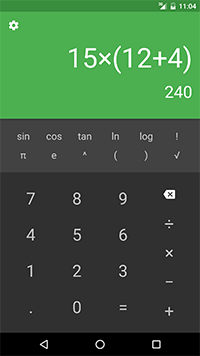

# android-calculator-v2

Calculator v2 is an advanced calculator app with functions such as trigonometry, logs, factorials, and more while still maintaining a simple and easy to use interface.

## Screenshots

